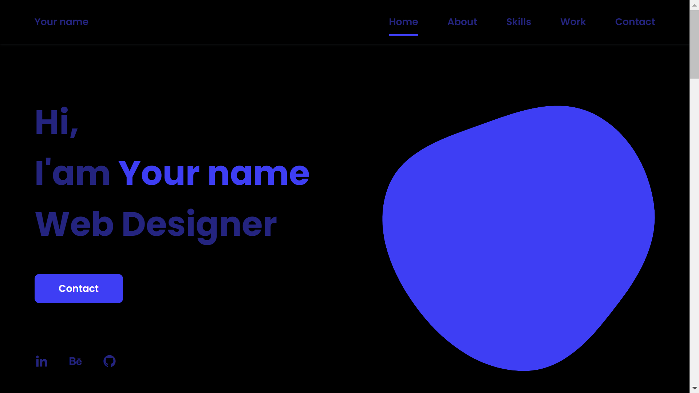

# Portfolio-responsive
    
    
 #  using Tools

 HTML (HyperText Markup Language)
Purpose: The backbone of any web page, HTML is used to structure content.

CSS (Cascading Style Sheets)
Purpose: CSS is used to style and layout web pages. It controls the look and feel of the web page, including colors, fonts, and spacing.

JavaScript
Purpose: JavaScript adds interactivity and dynamic behavior to web pages. It allows you to manipulate the HTML and CSS, respond to user events, and create interactive effects.

# Create Access Key

 <input type="hidden" name="access_key" value="YOUR_ACCESS_KEY_HERE">

 "YOUR_ACCESS_KEY_HERE"
click this link 
     
 https://web3forms.com/ 

and Create Access Key , Access key will be sent to your email address.


## Deploying to Netlify

Follow these steps to deploy your project to Netlify:

1. **Fork and Clone the Repository**:
   - Fork this repository to your GitHub account.
   - Clone the forked repository to your local machine.
     ```sh
     git clone https://github.com/bulbul1434/Portfolio-responsive.git
     cd Portfolio-responsive
     ```

2. **Install Netlify CLI**:
   - Make sure you have the Netlify CLI installed:
     ```sh
     npm install -g netlify-cli
     ```

3. **Login to Netlify**:
   - Log in to your Netlify account:
     ```sh
     netlify login
     ```

4. **Create and Link a New Site**:
   - Run the following command and follow the prompts:
     ```sh
     netlify init
     ```

5. **Deploy the Site**:
   - Deploy your site:
     ```sh
     netlify deploy
     ```

6. **Production Deployment**:
   - Deploy to production:
     ```sh
     netlify deploy --prod
     ```

